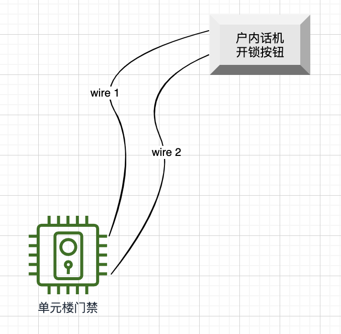
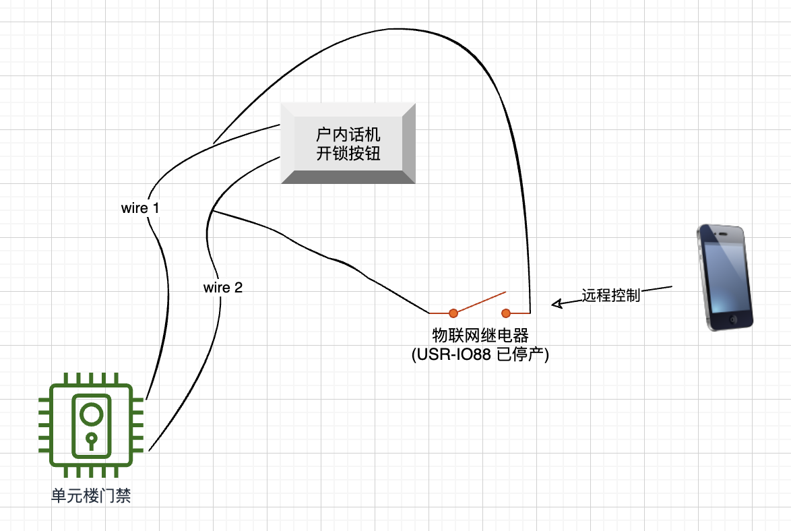

# 单元楼门禁远程控制系统

## 动机

1. 出门总是忘记带上单元楼门禁的钥匙，回家时如果家里没人，只能按邻居门铃祈求帮忙开门。
2. 快递员经常在家里没人的时候送货，此时如果可以解锁门禁让他进去，就可以将快递放我家门口。

## 思路

想要去掉钥匙，一个思路是将门禁系统上云，这样可以通过手机来远程开锁。

## 切入点

楼下的门禁总成是不能动的，否则物业会追杀我。因此只能在自家的终端话机上动脑筋。

## 原理

当有人在楼下的门禁总成上按了我们家的门铃，户内的话机会响，按话机上的一个按钮可以解锁门禁。这个按钮实际上是一个手动“继电器”。
那么如果我搞一个物联网继电器也接上去，然后通过互联网来操纵这个继电器的开关，那么就能够实现远程开锁了。

## 电路图

### 原始电路结构

### 改造后的电路结构

